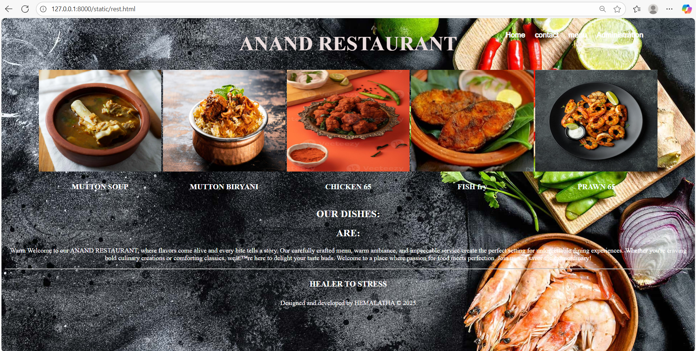
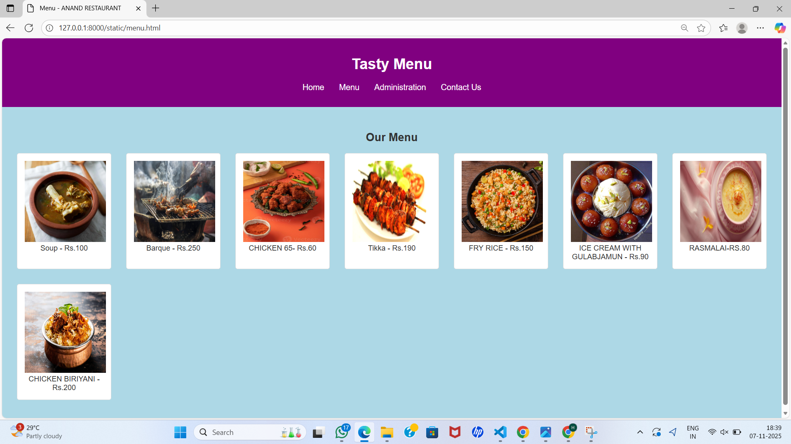
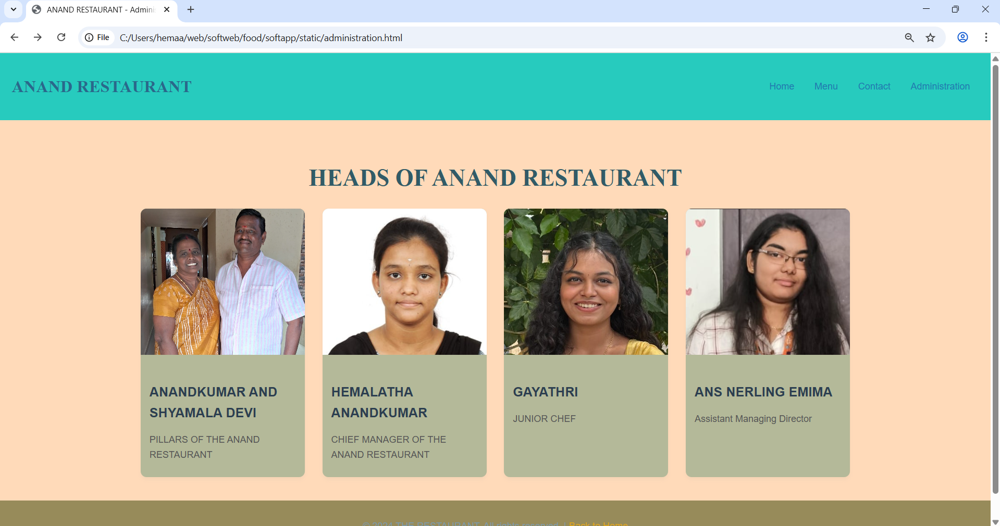
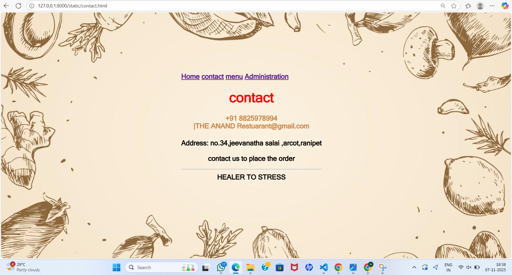

# Ex.07 Restuarant Website
## Date:07.11.2025

## AIM:
To develop a static Resturant website to display the menu and services provided by the resturant.

## DESIGN STEPS:

### Step 1:
Requirement collection.

### Step 2:
Creating the layout using HTML and CSS.

### Step 3:
Updating the sample content.

### Step 4:
Choose the appropriate style and color scheme.

### Step 5:
Validate the layout in various browsers.

### Step 6:
Validate the HTML code.

### Step 7:
Publish the website in the given URL.

## PROGRAM:
rest.html
```
<!DOCTYPE html>
<html lang="en"?>
    <head>
        <title> ANAND RESTAURANT</title>
        
    </head>
    <style>
        body{
            background-image: url("h4.jpg");
            background-size: cover;
            background-position: center;
        }
        .nav-list{
            position: absolute;
            top: 30px;
            left: 70%;
            transform:  translatex(10%);
        }
        .nav-list a{
            display: inline blocks;
            margin: 0 10px;
            font-family:MS Sans Serif;
            text-decoration: none;
            font-size: 18px;
            font-weight: bold;
            color: white;
        }
        .nav-list a:hover{
            color: rgb(235, 9, 149);
        }
    </style>
        <div class="nav-list">
        
        <a href="rest.html">Home</a>
        <a href="contact.html">contact</a>
        <a href="menu.html">menu</a>
        <a href="administration.html">Administration</a>

        </div>
    <body style="color: rgb(255, 255, 255);">
        
        <center>
            <h1 style="color:rgb(236, 222, 222); font-size: 50px;">ANAND RESTAURANT</h1>
    <table> 
        <center>
        <tr>
            <td></td>
            <td></td>
            <td></td>
            <td></td>
            <td></td>
        </tr>
        </center>
        <tr>
            <td><h3 style="color:white;"><center>MUTTON SOUP</center></h3></td>
            <td><h3 style="color:white;"><center>MUTTON BIRYANI</center></h3></td>
            <td><h3 style="color:azure;"><center>CHICKEN 65</center></h3></td>
            <td><h3 style="color:azure;"><center>FISH fry</center></h3></td>
            <td><h3 style="color:azure;"><center>PRAWN 65</center></h3></td>
        </tr>
    </table>
    <h2>OUR DISHES:
        <h2><center>ARE:</center></h2>
    </h2>
        <p style="font-family: 'Times New Roman',Times, serif";><center>Warm Welcome to our ANAND RESTAURANT, where flavors come alive and every bite tells a story. Our carefully crafted menu, warm ambiance, and impeccable service create the perfect setting for unforgettable dining experiences. Whether you're craving bold culinary creations or comforting classics, we’re here to delight your taste buds. Welcome to a place where passion for food meets perfection. Join us and savor the extraordinary!

        </p> 
        <hr>
        <tr>
            <td><h4 style="font-size: larger;"><center>HEALER TO STRESS</center></h4></td>
        </tr>
         <footer align="center" id="copywrite">
            Designed and developed by HEMALATHA   &copy 2025
        </footer>
    </body>        
</html>
```


menu.html
```
<!DOCTYPE html>
<html lang="en">
<head>
  <meta charset="UTF-8">
  <meta name="viewport" content="width=device-width, initial-scale=1.0">
  <title>Menu - ANAND RESTAURANT</title>
  <style>
    body { font-family: Arial, sans-serif; background: lightblue; margin: 0; color: #333; }
    .header, .footer { background: purple; color: #fff; text-align: center; padding: 1rem; }
    .header nav ul { list-style: none; display: flex; justify-content: center; padding: 0; }
    .header nav ul li { margin: 0 1rem; }
    .header nav ul li a { color: #fff; text-decoration: none; font-size: 1.1rem; }
    .menu { padding: 2rem; text-align: center; }
    .menu ul { list-style: none; padding: 0; display: grid; grid-template-columns: repeat(auto-fit, minmax(200px, 1fr)); gap: 2rem; }
    .menu ul li { background: #fff; border: 1px solid #ddd; padding: 1rem; border-radius: 5px; }
    .menu ul li:hover { transform: scale(1.05); transition: transform 0.3s; }
  </style>
</head>
<body>
  <header class="header">
    <h1>Tasty Menu</h1>
    <nav>
      <ul>
        <li><a href="res.html">Home</a></li>
        <li><a href="menu.html">Menu</a></li>
        <li><a href="adminis.html">Administration</a></li>
        <li><a href="contact.html">Contact Us</a></li>
      </ul>
    </nav>
  </header>
<section class="menu">
    <h2>Our Menu</h2>
    <ul>
        <li>
            
            Soup - Rs.100
        </li>
        <li>
            
            Barque - Rs.250
        </li>
        <li>
            
            CHICKEN 65- Rs.60
        </li>
        <li>
            
            Tikka - Rs.190
        </li>
        <li>
            
            FRY RICE - Rs.150
        </li>
        <li>
            
            ICE CREAM WITH GULABJAMUN - Rs.90
        </li>
        <li>
            
            RASMALAI-RS.80
        </li>
        <li>
            
            CHICKEN BIRIYANI - Rs.200
        </li>
        
    </ul>
</section>
```

admin.html
```
<!DOCTYPE html>
<html lang="en">
<head>
    <meta charset="UTF-8">
    <meta name="viewport" content="width=device-width, initial-scale=1.0">
    <title>ANAND RESTAURANT - Administration</title>

    <style>
        body {
            margin: 0;
            font-family: 'Roboto', sans-serif;
            line-height: 1.6;
            color: #2a688b;
            background-color: #f63a3a;
            box-sizing: border-box;
        }

        *, *::before, *::after {
            box-sizing: inherit;
        }

        header {
            background: #27cbbe;
            color: #2a688b(151, 69, 199);
            padding: 15px 20px;
            display: flex;
            align-items: center;
            justify-content: space-between;
            box-shadow: 0 4px 6px rgba(1, 33, 15, 0.1);
        }

        header h1 {
            font-size: 1.8rem;
            font-family: 'Playfair Display', serif;
        }

        header nav a {
            text-decoration: none;
            color: rgb(33, 121, 176);
            font-weight: 500;
            margin: 0 15px;
            transition: color 0.3s ease;
            font-size: 1rem;
        }

        header nav a:hover {
            color: #2a688b;
        }

        .admin-container {
            padding: 40px 20px;
            background: peachpuff;
            text-align: center;
        }

        .admin-container h1 {
            font-size: 2.5rem;
            color: #315b67;
            margin-bottom: 20px;
            font-family: 'Playfair Display', serif;
        }

        .admin-items {
            display: flex;
            flex-wrap: wrap;
            gap: 30px;
            justify-content: center;
        }

        .admin-item {
            background: rgb(180, 185, 153);
            border-radius: 10px;
            box-shadow: 0 4px 6px rgba(159, 154, 149, 0.1);
            width: 280px;
            overflow: hidden;
            transition: transform 0.3s ease;
            text-align: left;
        }

        .admin-item img {
            width: 100%;
            height: 250px;
            object-fit: cover;
        }

        .admin-item:hover {
            transform: scale(1.05);
        }

        .admin-details {
            padding: 15px;
        }

        .admin-details h3 {
            font-size: 1.4rem;
            color: #2c3e50;
            margin-bottom: 8px;
        }

        .admin-details p {
            font-size: 1rem;
            color: #555;
            margin-bottom: 10px;
        }

        footer {
            background: #978b5a;
            color: rgb(123, 154, 169);
            text-align: center;
            padding: 15px 0;
        }

        footer a {
            color: #dba419;
            text-decoration: none;
            font-weight: 500;
            transition: color 0.3s ease;
        }

        footer a:hover {
            color: #ecf0f1;
        }

        @media (max-width: 768px) {
            header h1 {
                font-size: 1.5rem;
            }

            .admin-items {
                flex-direction: column;
                gap: 20px;
            }

            .admin-item {
                width: 100%;
            }

            header nav a {
                font-size: 0.9rem;
                margin: 0 5px;
            }
        }
    </style>
</head>
<body>    

<header>
        <h1>ANAND RESTAURANT</h1>
        <nav>
            <a href="rest.html">Home</a>
            <a href="menu.html">Menu</a>
            <a href="contact.html">Contact</a>
            <a href="administration.html">Administration</a>
        </nav>
    </header>

    <div class="admin-container">
        <h1>HEADS OF ANAND RESTAURANT</h1>
        <div class="admin-items">
            <div class="admin-item">
                
                <div class="admin-details">
                    <h3>ANANDKUMAR AND SHYAMALA DEVI</h3>
                    <p>PILLARS OF THE ANAND RESTAURANT</p>
                </div>
            </div>

            <div class="admin-item">
                
                <div class="admin-details">
                    <h3>HEMALATHA ANANDKUMAR</h3>
                    <p>CHIEF MANAGER OF THE ANAND RESTAURANT</p>
                </div>
            </div>

            <div class="admin-item">
                
                <div class="admin-details">
                    <h3>GAYATHRI</h3>
                    <p>JUNIOR CHEF </p>
                </div>
            </div>

            <div class="admin-item">
                
                <div class="admin-details">
                    <h3>ANS NERLING EMIMA</h3>
                    <p>Assistant Managing Director </p>
                </div>
            </div>
        </div>
    </div>

    <footer>
        <p>&copy; 2024 THE RESTAURANT. All rights reserved. | <a href="resT.html">Back to Home</a></p>
    </footer>

</body>
</html>
```

contact.html
```
<html>
    <head>
        <title> CONTACT </title>
    </head>
    <style>
        
        body{
        
            background-image: url("food 1.jpg");
            background-size: cover;
            background-position: center;
        }
        body{
            display: inline blocks;
            margin:0 600px;
            font-family:MS Sans Serif;
            text-decoration: none;
            font-size: 23px;
            font-weight: bolder;
            color: lavender(217, 231, 239);
            position:absolute;
            top: 200px;
        }
    </style>
    <div class="nav-list">
        
        <a href="rest.html">Home</a>
        <a href="contact.html">contact</a>
        <a href="menu.html">menu</a>
        <a href="administration.html">Administration</a>

        </div>
    <center>
        <section id="contact">  
            <h1 style="color:red">contact<h1>
            <h4  style="color:peru">+91 8825978994 <br> |THE ANAND Restuarant@gmail.com</h4>
            <P  style="color:black">Address: no.34,jeevanatha salai ,arcot,ranipet<br>
                <br> contact us to place the order<br>
            <hr> HEALER TO STRESS 
            </P>
         </section> 
    </center>
    </body>
</html>

```
## OUTPUT:
rest.html


menu.html


admin.html


contact.html



## RESULT:
The program for designing software company website using HTML and CSS is completed successfully.
